# Manual Técnico — Proyecto 1
## SmartCity Tech Park

## 1. Introducción

SmartCity Tech Park es un complejo tecnológico que ha crecido de forma acelerada, integrando 4 áreas las cuales son un Centro de Datos que administra los servidores críticos de la empresa, un Centro de Investigación y Desarrollo (I+D), un Edificio Corporativo con personal administrativo y visitantes externos, y una Planta de Producción con maquinaria industrial heredada (Legacy).

Este proyecto consiste en el rediseño completo de la infraestructura de Capa 1 y Capa 2 del campus: se implementó una topología jerárquica con un núcleo central (Core), segmentación lógica mediante VLANs administradas centralizadamente con VTP, redundancia de enlaces mediante EtherChannel, prevención de bucles con Spanning Tree y aislamiento de tráfico entre las distintas áreas.

## 2. Topología

La red se diseñó en forma de estrella jerárquica, con `Core-DC` como núcleo central desde el cual se distribuyen 3 troncales hacia cada una de las demás áreas: `Corp-Dist` (Edificio Corporativo), `ID-SW1` (Centro de I+D) y `Planta-Access` (Planta de Producción), además de un cuarto enlace dedicado hacia `Srv-Farm` que es el switch que agrupa la granja de servidores.

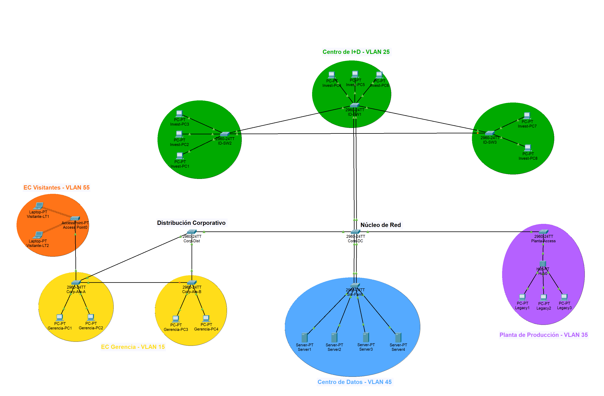

---

## 3. Áreas de la Topología

### 3.1 Centro de Datos (Core de la Red) — VLAN 45 SERVIDORES

Es el núcleo de toda la infraestructura, administra de forma centralizada el dominio VTP y concentra los 3 enlaces troncales hacia el resto del campus. También aloja una  granja de 4 servidores críticos de la empresa conectados a través del switch `Srv-Farm`. Como estos servidores no deben depender de una única conexión física, el enlace `Core-DC <-> Srv-Farm` se implementó como EtherChannel (2 puertos Gigabit agrupados) de forma que la falla de un cable no interrumpa el servicio y  se duplique el ancho de banda disponible.

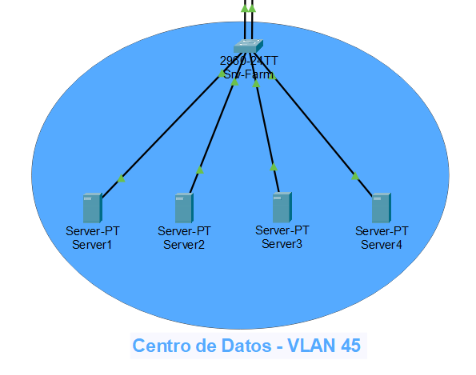

### 3.2 Centro de I+D (Investigación y Desarrollo) — VLAN 25 INVESTIGACION

Esta área exige alta disponibilidad ante la falla de cualquiera de sus switches. Se implementó con 3 switches (`ID-SW1`, `ID-SW2`, `ID-SW3`) interconectados entre sí en forma de triángulo, de manera que la caída de cualquiera de los tres no aísle a los otros dos — Spanning Tree bloquea automáticamente uno de los 3 enlaces para evitar el bucle, y lo reactiva si el enlace principal falla. El troncal hacia el Core debe soportar mayor ancho de banda que el resto de troncales del campus y como el modelo de switch utilizado no admite módulos de fibra óptica, se resolvió agrupando 2 puertos FastEthernet en un EtherChannel duplicando su capacidad frente a los demás enlaces troncales. El área cuenta con 8 estaciones de trabajo repartidas entre los 3 switches.

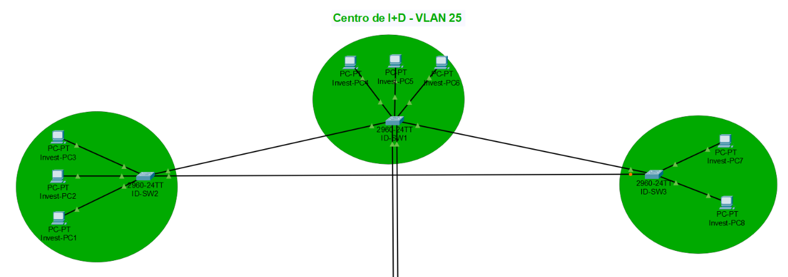

### 3.3 Edificio Corporativo (Gerencia) — VLAN 15 GERENCIA

Alberga al personal administrativo distribuido en dos alas con su propio switch de acceso cada una (`Corp-Ala-A` y `Corp-Ala-B`). La conectividad entre ambas alas debe mantenerse activa aunque falle la ruta hacia el switch de distribución más cercano, por eso además de estar conectadas a `Corp-Dist`, se agregó un enlace directo entre las dos alas, formando un tercer triángulo de redundancia resuelto igualmente por Spanning Tree.

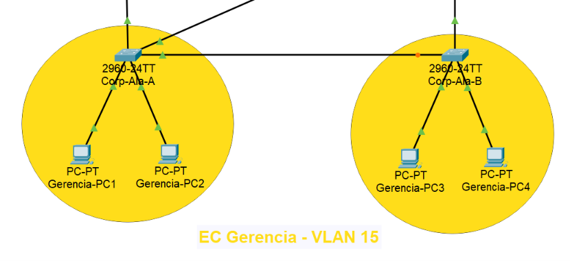

### 3.4 Edificio Corporativo (Visitantes) — VLAN 55 VISITANTES

Esta área está dedicada a invitados externos del Edificio Corporativo, con acceso inalámbrico a través de un Access Point (`Access Point0`, SSID `SmartCity_Visitantes`, autenticación WPA2-PSK). El tráfico y la administración de VLANs de este segmento deben estar completamente aislados del resto del campus, para esto se asignó el puerto del AP a la VLAN 55 que es una VLAN separada de la de Gerencia aunque física comparta el mismo switch `Corp-Ala-A`. Esto se comprobó en las pruebas de conectividad, que ningún dispositivo conectado al AP puede alcanzar la red de Gerencia ni ninguna otra VLAN del campus.

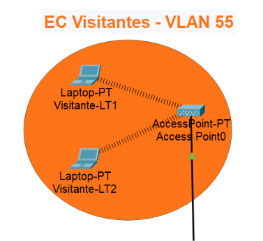

### 3.5 Planta de Producción — VLAN 35 PRODUCCION

En esta área se opera con maquinaria antigua (Legacy) que no admite una migración inmediata a equipos de conmutación modernos. Para representar esta limitación, las 3 máquinas Legacy se conectan a un **Hub** que retransmite cualquier señal recibida hacia todos sus puertos por igual. El Hub se conecta al resto de la red mediante un único cable hacia el switch de acceso `Planta-Access` con puerto está asignado a la VLAN 35, esto contiene el impacto del dominio de colisión compartido y del tráfico de broadcast que genera el segmento Legacy dentro de su propia VLAN, sin que afecte a Gerencia, Investigación, Servidores o Visitantes y sin necesidad de eliminar el segmento Legacy.

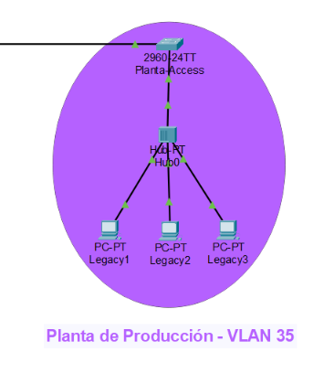

---

## 4. Tabla de Dominios de Colisión

En un switch cada puerto activo constituye su propio dominio de colisión (opera en full-duplex), mientras que un Hub une varios puertos en un único dominio compartido..

| Switch | Puertos activos | Dominios de colisión que genera |
|---|---|---|
| Core-DC | Fa0/1, Fa0/4, Gig0/1, Gig0/2, Fa0/2, Fa0/3 | 6 |
| Srv-Farm | Gig0/1, Gig0/2, Fa0/1, Fa0/2, Fa0/3, Fa0/4 | 6 |
| Corp-Dist | Fa0/1, Fa0/2, Fa0/3 | 3 |
| Corp-Ala-A | Fa0/1, Fa0/2, Fa0/3, Fa0/4, Fa0/5 | 5 |
| Corp-Ala-B | Fa0/1, Fa0/2, Fa0/4, Fa0/5 | 4 |
| ID-SW1 | Fa0/2, Fa0/3, Fa0/4, Fa0/5, Fa0/6, Fa0/7, Fa0/8 | 7 |
| ID-SW2 | Fa0/1, Fa0/2, Fa0/3, Fa0/4, Fa0/5 | 5 |
| ID-SW3 | Fa0/1, Fa0/2, Fa0/3, Fa0/4 | 4 |
| Planta-Access | Fa0/1, Fa0/4 | 2 |
| **Total (switches)** | | **42** |

| Dominio de colisión compartido (Hub0) | Dispositivos |
|---|---|
| 1 (único, compartido) | Legacy1, Legacy2, Legacy3, Planta-Access (vía Fa0/1) |

---

## 5. Tabla de Dominios de Broadcast

Cada VLAN constituye un dominio de broadcast independiente. Al no existir enrutamiento entre VLANs, los 5 dominios están completamente aislados entre sí, garantizando el aislamiento de seguridad en áreas como Visitantes y Gerencia.

| VLAN ID | Nombre | Dispositivos incluidos | Switches que la propagan |
|---|---|---|---|
| 15 | GERENCIA | Gerencia-PC1 a PC4 | Corp-Dist, Corp-Ala-A, Corp-Ala-B |
| 25 | INVESTIGACION | Invest-PC1 a PC8 | ID-SW1, ID-SW2, ID-SW3 |
| 35 | PRODUCCION | Legacy1 a Legacy3 (vía Hub0) | Planta-Access |
| 45 | SERVIDORES | Server1 a Server4 | Srv-Farm |
| 55 | VISITANTES | Visitante-LT1, LT2 (vía AP) | Corp-Ala-A |

---

## 6. Tabla de VLANs

| VLAN ID | Nombre |
|---|---|
| 15 | GERENCIA |
| 25 | INVESTIGACION |
| 35 | PRODUCCION |
| 45 | SERVIDORES |
| 55 | VISITANTES |

---

## 7. Tabla de Asignación de Puertos por Switch

| Switch | Puerto | Tipo | VLAN / Destino |
|---|---|---|---|
| **Core-DC** | Fa0/1 | Trunk | → Corp-Dist |
| | Fa0/4 | Trunk | → Planta-Access |
| | Gig0/1-2 (Po1) | Trunk (EtherChannel PAgP) | → Srv-Farm |
| | Fa0/2-3 (Po2) | Trunk (EtherChannel PAgP) | → ID-SW1 |
| **Srv-Farm** | Gig0/1-2 (Po1) | Trunk (EtherChannel PAgP) | → Core-DC |
| | Fa0/1-4 | Access | VLAN 45 → Server1-4 |
| **Corp-Dist** | Fa0/1 | Trunk | → Core-DC |
| | Fa0/2 | Trunk | → Corp-Ala-A |
| | Fa0/3 | Trunk | → Corp-Ala-B |
| **Corp-Ala-A** | Fa0/1 | Trunk | → Corp-Dist |
| | Fa0/2 | Trunk | → Corp-Ala-B |
| | Fa0/3 | Access | VLAN 55 → Access Point0 |
| | Fa0/4-5 | Access | VLAN 15 → Gerencia-PC1, PC2 |
| **Corp-Ala-B** | Fa0/1 | Trunk | → Corp-Dist |
| | Fa0/2 | Trunk | → Corp-Ala-A |
| | Fa0/4-5 | Access | VLAN 15 → Gerencia-PC3, PC4 |
| **ID-SW1** | Fa0/2-3 (Po2) | Trunk (EtherChannel PAgP) | → Core-DC |
| | Fa0/4 | Trunk | → ID-SW2 |
| | Fa0/5 | Trunk | → ID-SW3 |
| | Fa0/6-8 | Access | VLAN 25 → Invest-PC4, PC5, PC6 |
| **ID-SW2** | Fa0/1 | Trunk | → ID-SW1 |
| | Fa0/2 | Trunk | → ID-SW3 |
| | Fa0/3-5 | Access | VLAN 25 → Invest-PC1, PC2, PC3 |
| **ID-SW3** | Fa0/1 | Trunk | → ID-SW1 |
| | Fa0/2 | Trunk | → ID-SW2 |
| | Fa0/3-4 | Access | VLAN 25 → Invest-PC7, PC8 |
| **Planta-Access** | Fa0/4 | Trunk | → Core-DC |
| | Fa0/1 | Access | VLAN 35 → Hub0 (Legacy1-3) |

Todos los enlaces trunk usan VLAN nativa 95 y encapsulación 802.1Q.

---

## 8. Lista de Comandos Utilizados (por dispositivo)

### 8.1 Core-DC
```
enable
configure terminal
vtp mode server
vtp domain Smart_5
vtp password proyecto12S2026
vlan 15
 name GERENCIA
exit
vlan 25
 name INVESTIGACION
exit
vlan 35
 name PRODUCCION
exit
vlan 45
 name SERVIDORES
exit
vlan 55
 name VISITANTES
exit
interface fastEthernet 0/1
 switchport mode trunk
 switchport trunk native vlan 95
exit
interface fastEthernet 0/4
 switchport mode trunk
 switchport trunk native vlan 95
exit
interface range gigabitEthernet 0/1-2
 switchport mode trunk
 channel-group 1 mode desirable
exit
interface port-channel 1
 switchport trunk native vlan 95
exit
interface range fastEthernet 0/2-3
 switchport mode trunk
 channel-group 2 mode desirable
exit
interface port-channel 2
 switchport trunk native vlan 95
exit
spanning-tree mode rapid-pvst
spanning-tree vlan 1,15,25,35,45,55 root primary
banner motd #Acceso Restringido - TechPark_202402955#
```

### 8.2 Srv-Farm
```
enable
configure terminal
vtp mode client
vtp domain Smart_5
vtp password proyecto12S2026
interface range gigabitEthernet 0/1-2
 switchport mode trunk
 channel-group 1 mode desirable
exit
interface port-channel 1
 switchport trunk native vlan 95
exit
interface range fastEthernet 0/1-4
 switchport mode access
 switchport access vlan 45
exit
spanning-tree mode rapid-pvst
banner motd #Acceso Restringido - TechPark_202402955#
```

### 8.3 Corp-Dist
```
enable
configure terminal
vtp mode client
vtp domain Smart_5
vtp password proyecto12S2026
interface range fastEthernet 0/1-3
 switchport mode trunk
 switchport trunk native vlan 95
exit
spanning-tree mode rapid-pvst
banner motd #Acceso Restringido - TechPark_202402955#
```

### 8.4 Corp-Ala-A
```
enable
configure terminal
vtp mode client
vtp domain Smart_5
vtp password proyecto12S2026
interface range fastEthernet 0/1-2
 switchport mode trunk
 switchport trunk native vlan 95
exit
interface fastEthernet 0/3
 switchport mode access
 switchport access vlan 55
exit
interface range fastEthernet 0/4-5
 switchport mode access
 switchport access vlan 15
exit
spanning-tree mode rapid-pvst
banner motd #Acceso Restringido - TechPark_202402955#
```

### 8.5 Corp-Ala-B
```
enable
configure terminal
vtp mode client
vtp domain Smart_5
vtp password proyecto12S2026
interface range fastEthernet 0/1-2
 switchport mode trunk
 switchport trunk native vlan 95
exit
interface range fastEthernet 0/4-5
 switchport mode access
 switchport access vlan 15
exit
spanning-tree mode rapid-pvst
banner motd #Acceso Restringido - TechPark_202402955#
```

### 8.6 ID-SW1
```
enable
configure terminal
vtp mode client
vtp domain Smart_5
vtp password proyecto12S2026
interface fastEthernet 0/4
 switchport mode trunk
 switchport trunk native vlan 95
exit
interface fastEthernet 0/5
 switchport mode trunk
 switchport trunk native vlan 95
exit
interface range fastEthernet 0/2-3
 switchport mode trunk
 channel-group 2 mode desirable
exit
interface port-channel 2
 switchport trunk native vlan 95
exit
interface range fastEthernet 0/6-8
 switchport mode access
 switchport access vlan 25
exit
spanning-tree mode rapid-pvst
banner motd #Acceso Restringido - TechPark_202402955#
```

### 8.7 ID-SW2
```
enable
configure terminal
vtp mode client
vtp domain Smart_5
vtp password proyecto12S2026
interface range fastEthernet 0/1-2
 switchport mode trunk
 switchport trunk native vlan 95
exit
interface range fastEthernet 0/3-5
 switchport mode access
 switchport access vlan 25
exit
spanning-tree mode rapid-pvst
banner motd #Acceso Restringido - TechPark_202402955#
```

### 8.8 ID-SW3
```
enable
configure terminal
vtp mode client
vtp domain Smart_5
vtp password proyecto12S2026
interface range fastEthernet 0/1-2
 switchport mode trunk
 switchport trunk native vlan 95
exit
interface range fastEthernet 0/3-4
 switchport mode access
 switchport access vlan 25
exit
spanning-tree mode rapid-pvst
banner motd #Acceso Restringido - TechPark_202402955#
```

### 8.9 Planta-Access
```
enable
configure terminal
vtp mode client
vtp domain Smart_5
vtp password proyecto12S2026
interface fastEthernet 0/4
 switchport mode trunk
 switchport trunk native vlan 95
exit
interface fastEthernet 0/1
 switchport mode access
 switchport access vlan 35
exit
spanning-tree mode rapid-pvst
banner motd #Acceso Restringido - TechPark_202402955#
```

---

## 9. Switch Servidor VTP

Se seleccionó `Core-DC` como VTP Server porque es el switch núcleo, al ser el punto más centralizado de la red es el candidato natural para administrar de forma centralizada la creación de VLANs, evitando inconsistencias que surgirían si cada switch de acceso creara sus propias VLANs de forma independiente. Los 8 switches restantes se configuraron en modo Client dominio `Smart_5`, para recibir automáticamente las VLANs sin poder modificarlas localmente y así reducir el margen de error de configuración manual repetida.

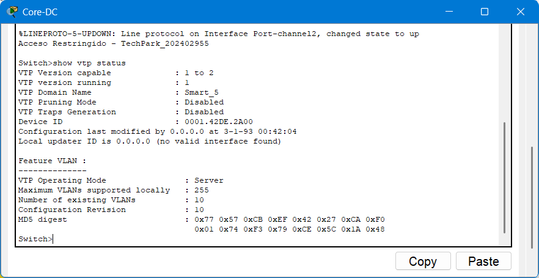

---

## 10. Root Bridge (STP)

Se forzó a `Core-DC` como Root Bridge de las 6 VLANs activas (`spanning-tree vlan 1,15,25,35,45,55 root primary`) porque es el switch central de la topología jerárquica y garantiza que los caminos calculados por STP hacia cualquier otro punto del campus sean los más cortos posibles. Si no se configurar manualmente, el STP habría elegido automáticamente el switch con la dirección MAC numéricamente más baja (`Corp-Dist`), una elección arbitraria que podría generar rutas menos eficientes entre zonas alejadas del campus.

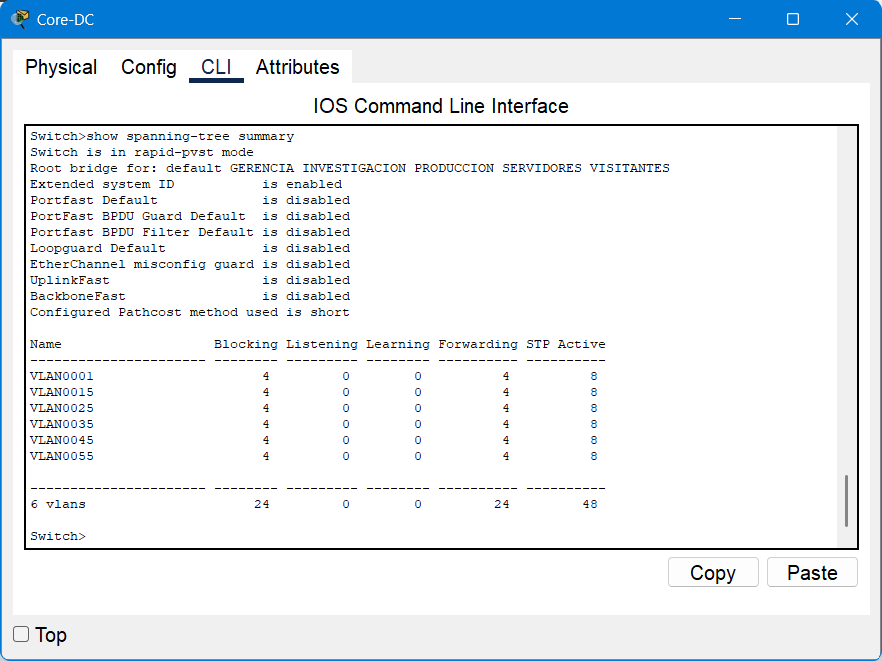

---

## 11. EtherChannel

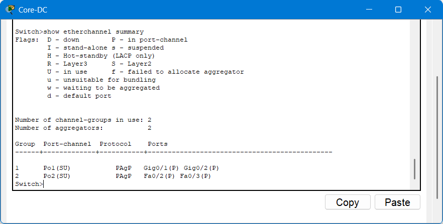

Se implementaron 2 EtherChannel usando PAgP (carnet impar):

- **Core-DC ↔ Srv-Farm** (Po1, puertos Gig0/1-2): La granja de servidores no debe depender de una única conexión física. Agrupar 2 enlaces Gigabit garantiza que ante la falla de un cable, el tráfico continúe fluyendo por el enlace restante sin interrupción de servicio, además de duplicar el ancho de banda disponible hacia los servidores críticos.

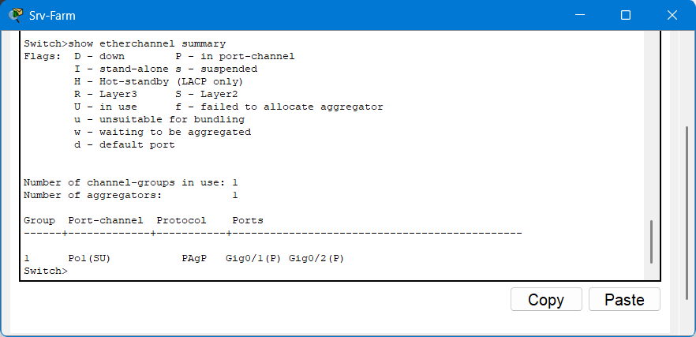

- **Core-DC ↔ ID-SW1** (Po2, puertos Fa0/2-3): Ya que se exige que el troncal hacia el Centro de I+D soporte mayor demanda de ancho de banda que el resto de los enlaces troncales del campus. Al no contar con módulos de fibra óptica disponibles en el modelo de switch utilizado (2960-24TT, configuración fija sin slots SFP), se optó por agregar 2 puertos FastEthernet mediante EtherChannel duplicando la capacidad de ese enlace específico respecto a los demás troncales del campus.

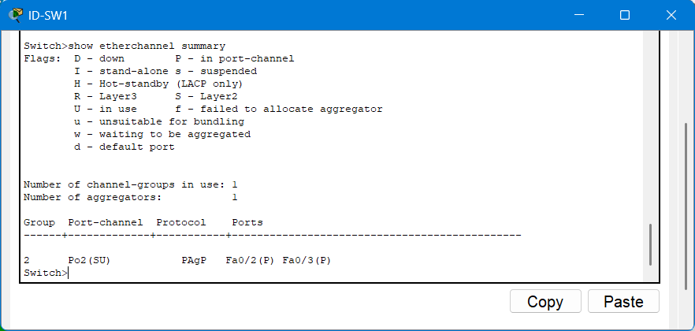

---

## 12. Evidencia de Pruebas

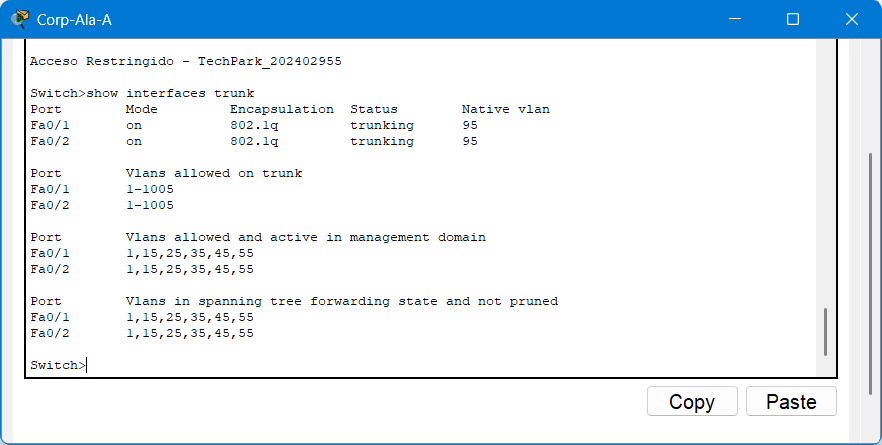

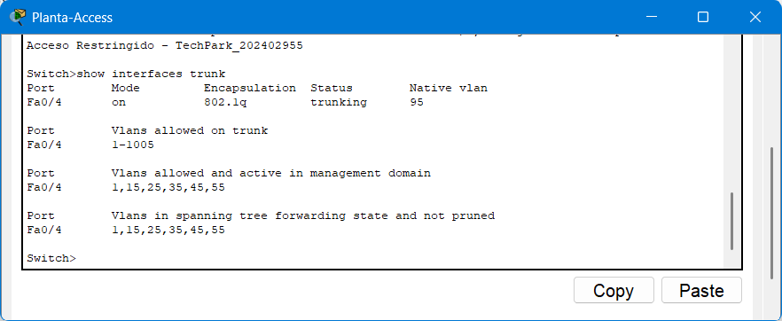

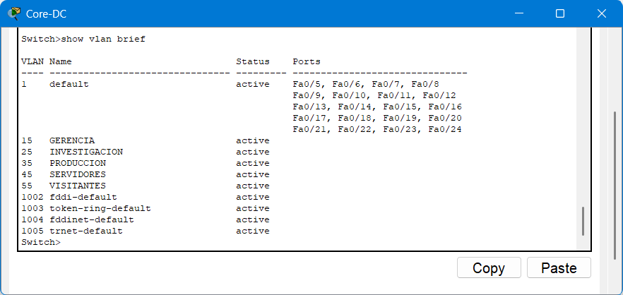

### 12.1 Pruebas de conectividad (ping)

| Prueba | Origen | Destino | Resultado esperado | Resultado obtenido |
|---|---|---|---|---|
| Intra-VLAN | Gerencia-PC1 (192.168.15.10) | Gerencia-PC3 (192.168.15.12) | Éxito | 4/4 paquetes, 0% pérdida |
| Inter-VLAN | Gerencia-PC1 (VLAN 15) | Invest-PC1 (192.168.25.10, VLAN 25) | Fallo (aislamiento) | 4/4 timeout, 100% pérdida |
| Inter-VLAN (wireless) | Visitante-LT1 (VLAN 55) | Gerencia-PC1 (192.168.15.10, VLAN 15) | Fallo (aislamiento) | 4/4 timeout, 100% pérdida |

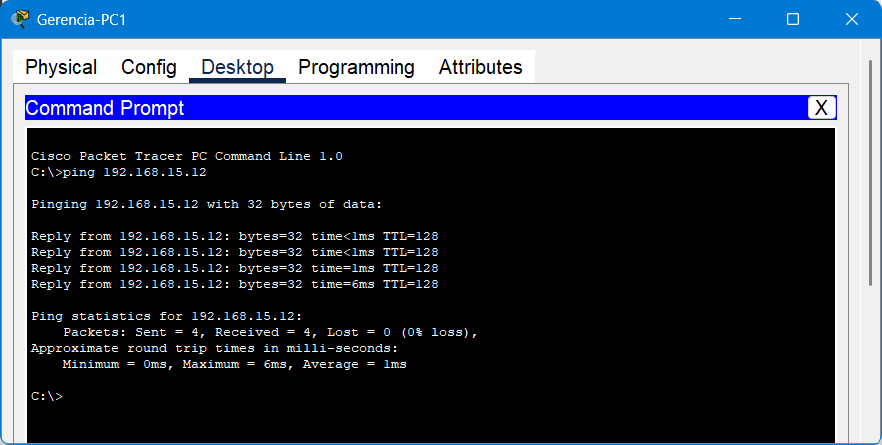

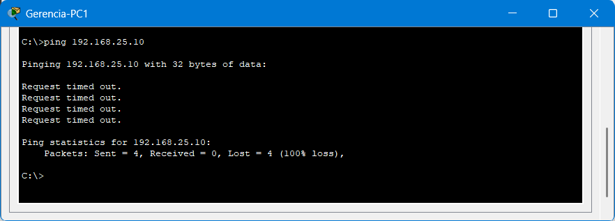

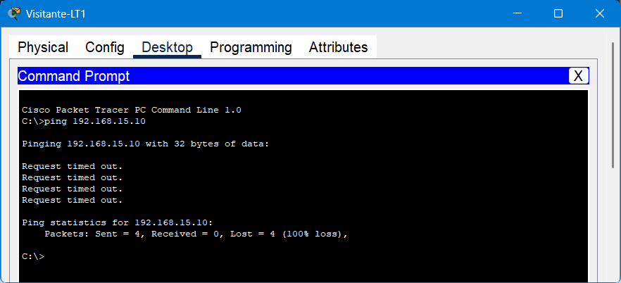

Se confirma el 100% de conectividad intra-VLAN y el aislamiento inter-VLAN en toda la topología, cumpliendo el objetivo SMART del proyecto.

---

## 13. Medios de Transmisión

Todos los enlaces de la topología se implementaron con **cableado de cobre UTP Cat6 (Straight-Through)**, incluyendo los enlaces switch-switch entre edificios. El campus SmartCity Tech Park es un entorno compacto donde las distancias entre los 4 sectores (Centro de Datos, I+D, Edificio Corporativo, Planta de Producción) no superan los 100 metros. Por esta razón se optó por cobre en toda la topología, priorizando menor costo de implementación frente a fibra óptica que se reserva típicamente para distancias mayores o para eliminar interferencia electromagnética en entornos industriales severos. Además, el modelo de switch utilizado (Cisco 2960-24TT) tiene configuración fija sin slots de expansión SFP por lo que no admite módulos de fibra.

Para compensar la necesidad de mayor capacidad en los enlaces críticos (servidores y el troncal hacia I+D), se utilizaron los puertos Gigabit Ethernet disponibles y la técnica de EtherChannel (agregación de puertos FastEthernet), en lugar de recurrir a fibra óptica.

---

## 14. Presupuesto Estimado

| Ítem | Cantidad | Precio unitario estimado (USD) | Subtotal (USD) |
|---|---|---|---|
| Switch Cisco Catalyst 2960-24TT | 9 | $650.00 | $5,850.00 |
| Hub Ethernet (segmento Legacy) | 1 | $35.00 | $35.00 |
| Access Point inalámbrico (Cisco/Linksys clase empresarial) | 1 | $120.00 | $120.00 |
| Cable UTP Cat6 (rollo de 305m, promedio de uso estimado) | 3 | $85.00 | $255.00 |
| Conectores RJ45 Cat6 (caja de 100) | 1 | $18.00 | $18.00 |
| Servidores (rack, uso genérico) | 4 | $1,800.00 | $7,200.00 |
| Tarjeta de red inalámbrica (laptops de visitantes) | 2 | $25.00 | $50.00 |
| **Total estimado** | | | **$13,528.00** |

---

## 15. Parámetros de Diseño (carnet: 202402955)

| Parámetro | Valor |
|---|---|
| Dominio VTP | Smart_5 |
| Contraseña VTP | proyecto12S2026 |
| VLAN nativa | 95 |
| Protocolo EtherChannel | PAgP (carnet impar) |
| Protocolo STP | Rapid-PVST (carnet impar) |
| Banner MOTD | Acceso Restringido - TechPark_202402955 |