# MANUAL TÉCNICO - Tarea #3

## 1. Objetivo

Configurar una red en Cisco Packet Tracer implementando VLANs y el protocolo VTP en sus tres modos de operación (servidor, cliente y transparente), verificando la correcta propagación de VLANs entre switches y comprobando la conectividad entre PCs de la misma VLAN mediante pruebas de ping, identificando además el aislamiento entre VLANs distintas.

---

## 2. Topología

La red está compuesta por 4 switches Cisco 2960 y 6 PCs:

- **Switch0**: switch central, conectado mediante enlaces trunk a los tres switches de acceso.
- **ADMIN**, **MERCA**, **VENTAS**: switches de acceso, cada uno con 2 PCs conectadas.

| Switch | VLAN | Nombre VLAN | Rango IP | PCs conectadas |
|---|---|---|---|---|
| ADMIN | 10 | ADMIN | 192.168.10.0/24 | PC1, PC2 |
| MERCA | 20 | MERCA | 192.168.20.0/24 | PC3, PC4 |
| VENTAS | 30 | VENTAS | 192.168.30.0/24 | PC5, PC6 |

Dominio VTP utilizado: `REDES1`

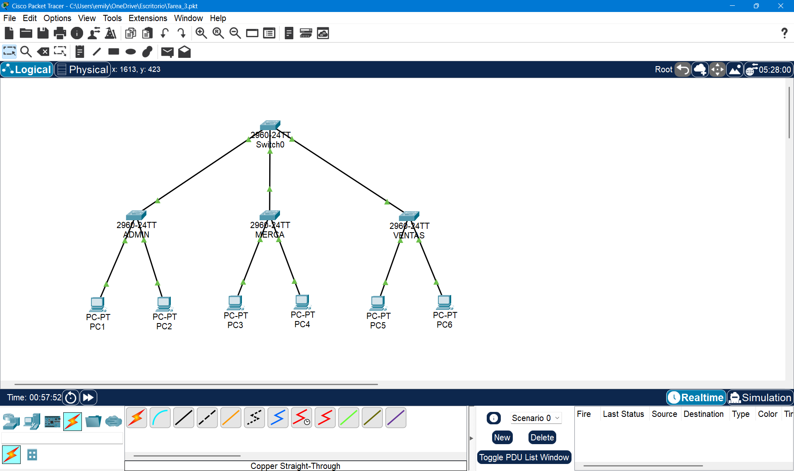

---

## 3. Configuración de enlaces trunk

Antes de configurar el VTP y las VLANs, se establecieron enlaces trunk entre Switch0 y cada switch de acceso, a continuacion se muestra la configuración de cada switch.

### Switch0
```
enable
conf t
hostname Switch0
interface FastEthernet0/1
 switchport mode trunk
interface FastEthernet0/2
 switchport mode trunk
interface FastEthernet0/3
 switchport mode trunk
exit
exit
show interfaces trunk
```

### ADMIN
```
enable
conf t
hostname ADMIN
interface FastEthernet0/1
 switchport mode trunk
exit
exit
```

### MERCA
```
enable
conf t
hostname MERCA
interface FastEthernet0/1
 switchport mode trunk
exit
exit
```

### VENTAS
```
enable
conf t
hostname VENTAS
interface FastEthernet0/1
 switchport mode trunk
exit
exit
```

---

## 4. Configuración de VTP

Se configuró el dominio VTP `REDES1` en los 4 switches, cada uno con su respectivo modo.

### Switch0 — Modo Servidor
```
conf t
vtp domain REDES1
vtp mode server
exit
show vtp status
```
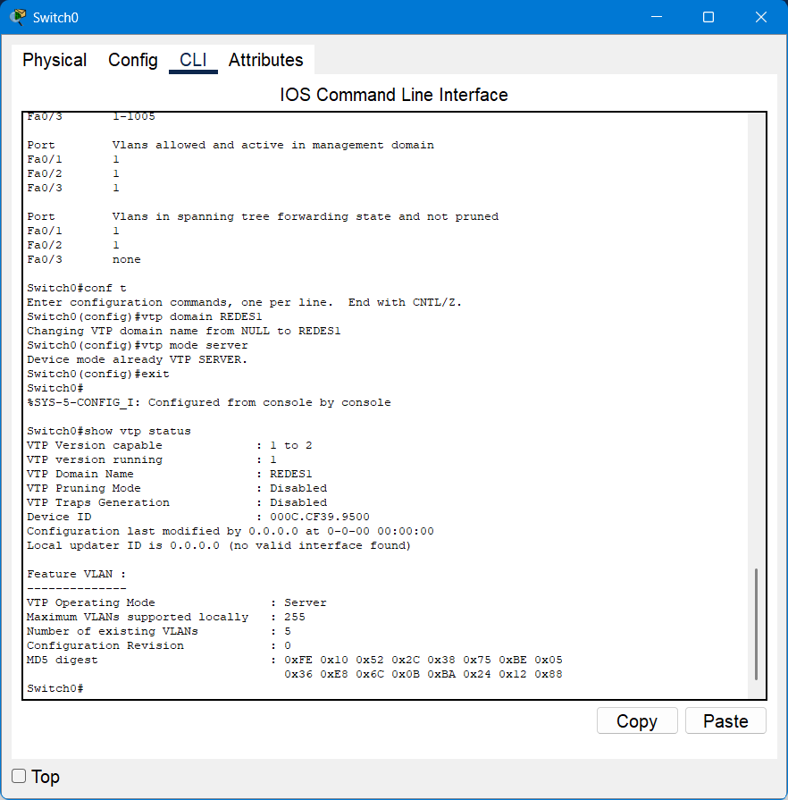

### ADMIN — Modo Cliente
```
conf t
vtp domain REDES1
vtp mode client
exit
show vtp status
```
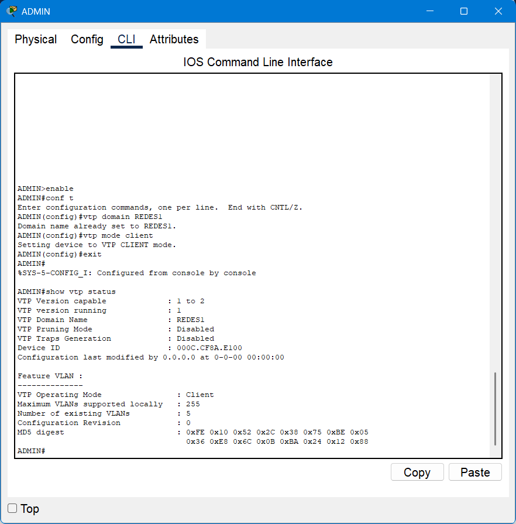

### MERCA — Modo Cliente
```
conf t
vtp domain REDES1
vtp mode client
exit
show vtp status
```


### VENTAS — Modo Transparente
```
conf t
vtp domain REDES1
vtp mode transparent
exit
show vtp status
```
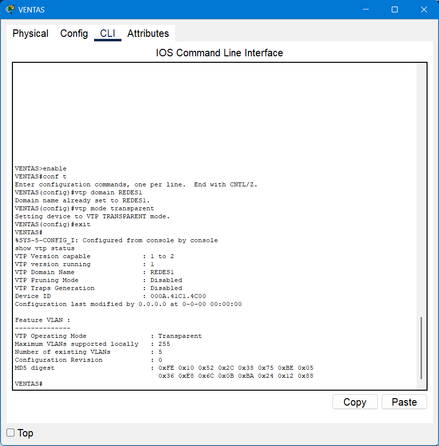

---

## 5. Creación de VLANs

Las VLANs se crearon en el Switch0 y se propagaron automáticamente por VTP a los switches en modo cliente (ADMIN y MERCA), mientras que VENTAS está en modo transparente, así no recibe VLANs por VTP y se creó de forma local.

### Switch0 (servidor — se crean y propagan)
```
conf t
vlan 10
 name ADMIN
exit
vlan 20
 name MERCA
exit
vlan 30
 name VENTAS
exit
exit
show vlan brief
```
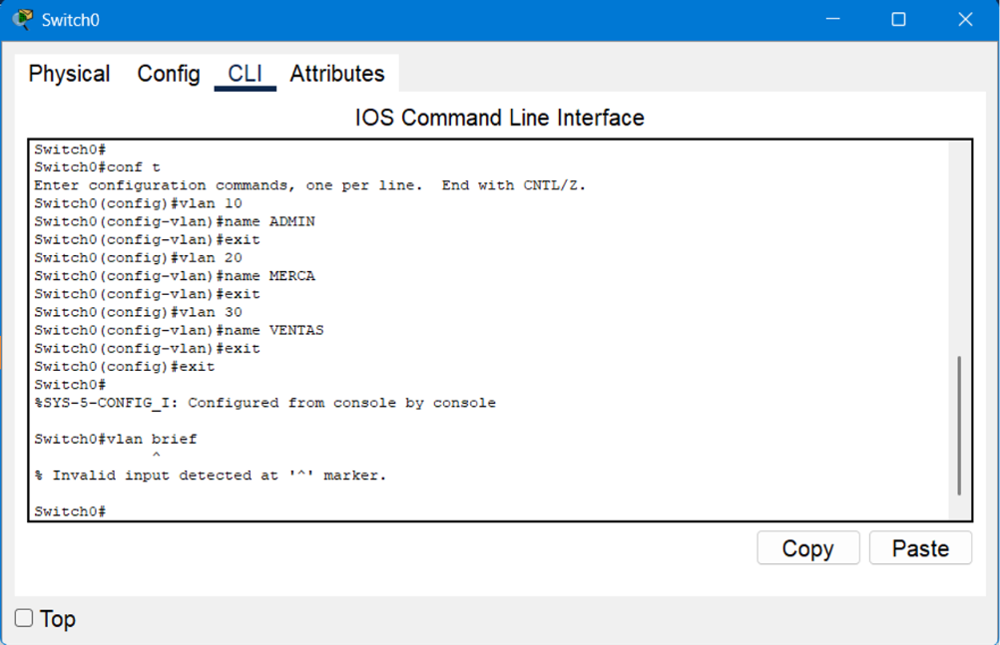


### ADMIN y MERCA (clientes — solo reciben, no se crean localmente)
```
show vlan brief
```
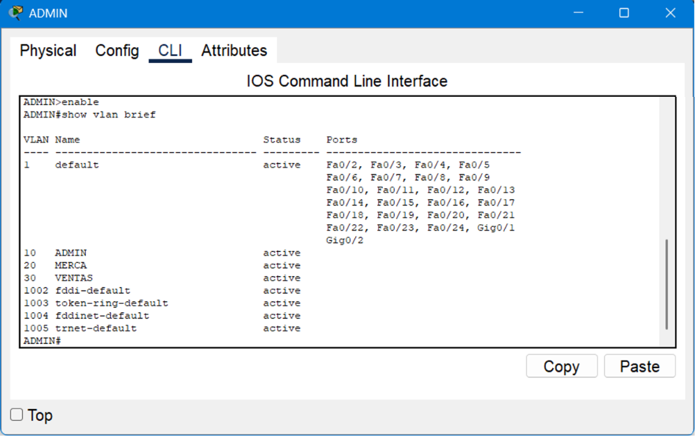


### VENTAS (transparente — se crea localmente)
```
conf t
vlan 30
 name VENTAS
exit
exit
show vlan brief
```
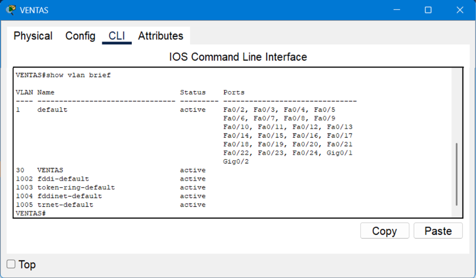

---

## 6. Asignación de puertos de acceso

Se asignaron los puertos conectados a las PCs como `access`, cada uno a su VLAN correspondiente.

### ADMIN (VLAN 10)
```
conf t
interface FastEthernet0/2
 switchport mode access
 switchport access vlan 10
exit
interface FastEthernet0/3
 switchport mode access
 switchport access vlan 10
exit
exit
show vlan brief
```

### MERCA (VLAN 20)
```
conf t
interface FastEthernet0/2
 switchport mode access
 switchport access vlan 20
exit
interface FastEthernet0/3
 switchport mode access
 switchport access vlan 20
exit
exit
show vlan brief
```

### VENTAS (VLAN 30)
```
conf t
interface FastEthernet0/2
 switchport mode access
 switchport access vlan 30
exit
interface FastEthernet0/3
 switchport mode access
 switchport access vlan 30
exit
exit
show vlan brief
```

En cada switch, los puertos Fa0/2 y Fa0/3 quedaron listados bajo su VLAN correspondiente en lugar de la VLAN 1 (default).

---

## 7. Direccionamiento IP de las PCs

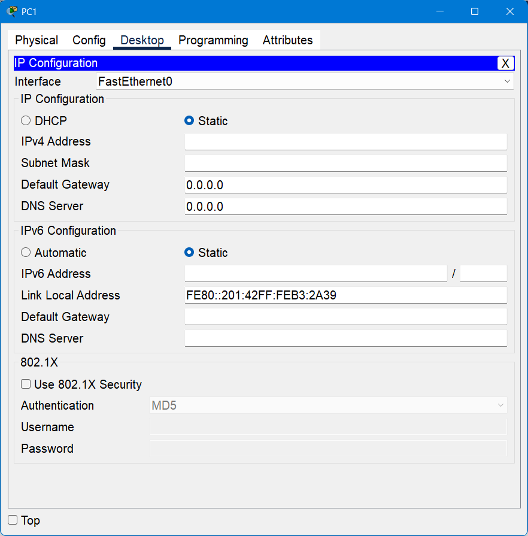

| PC | Switch | VLAN | IPv4 Address | Subnet Mask |
|---|---|---|---|---|
| PC1 | ADMIN | 10 | 192.168.10.2 | 255.255.255.0 |
| PC2 | ADMIN | 10 | 192.168.10.3 | 255.255.255.0 |
| PC3 | MERCA | 20 | 192.168.20.2 | 255.255.255.0 |
| PC4 | MERCA | 20 | 192.168.20.3 | 255.255.255.0 |
| PC5 | VENTAS | 30 | 192.168.30.2 | 255.255.255.0 |
| PC6 | VENTAS | 30 | 192.168.30.3 | 255.255.255.0 |
---

## 8. Pruebas de conectividad

### Ping PC1 exitoso


### Ping PC2 exitoso


### Ping PC3 exitoso
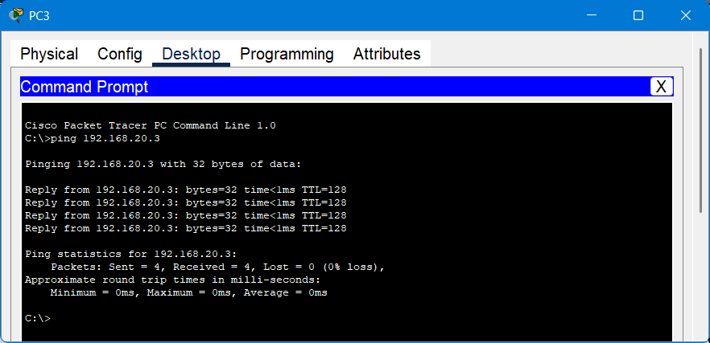

### Ping PC4 exitoso
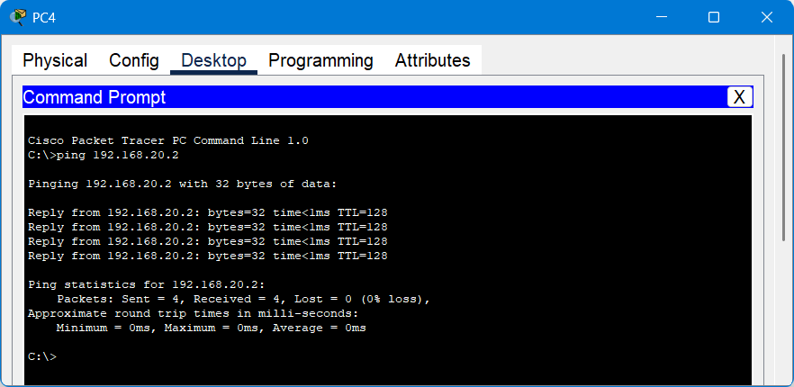

### Ping PC5 exitoso


### Ping PC6 exitoso
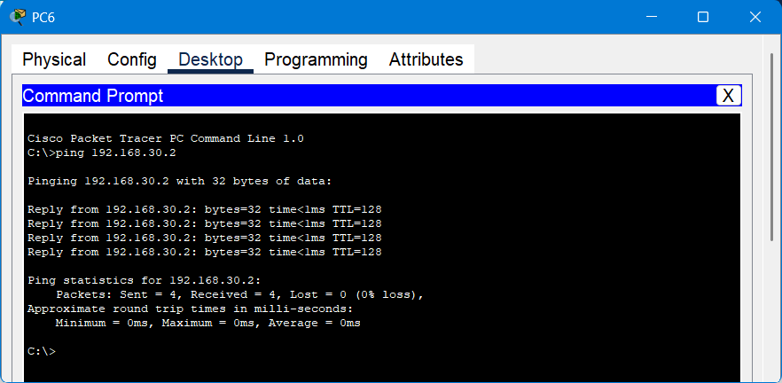

### Ping fallido — VLANs distintas
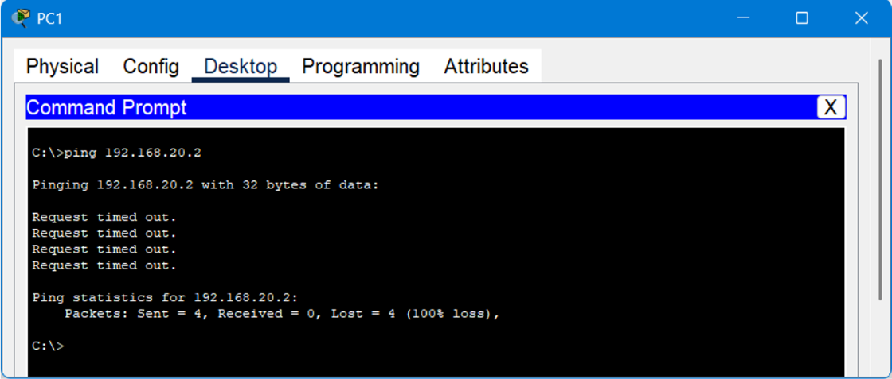
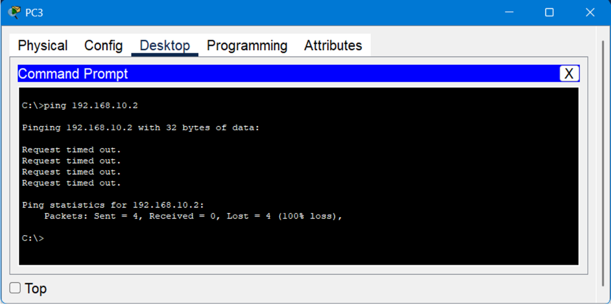

---
